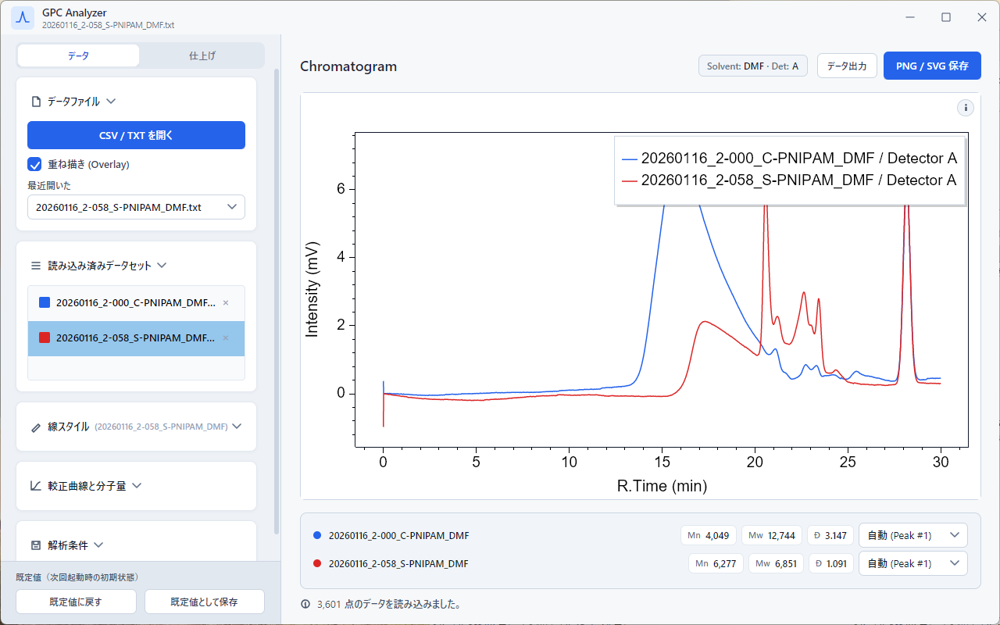
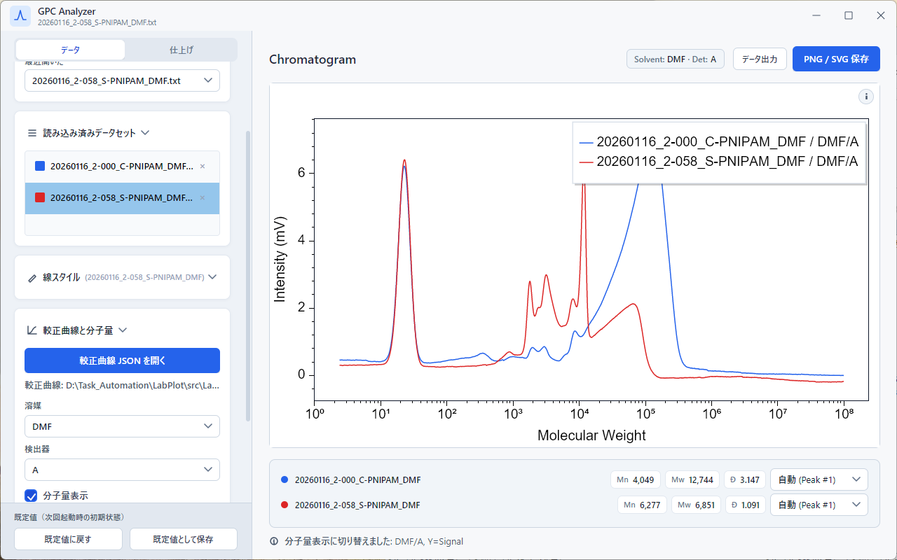
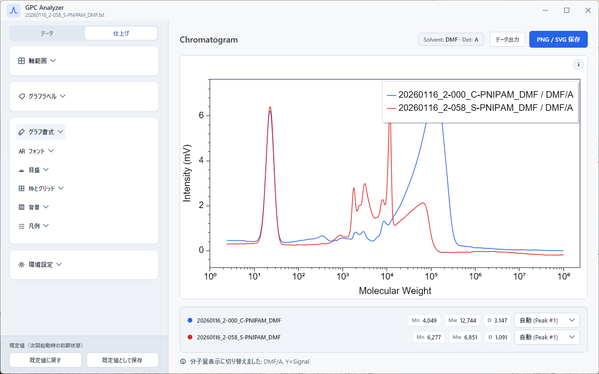
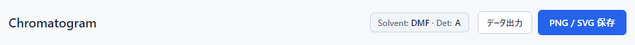
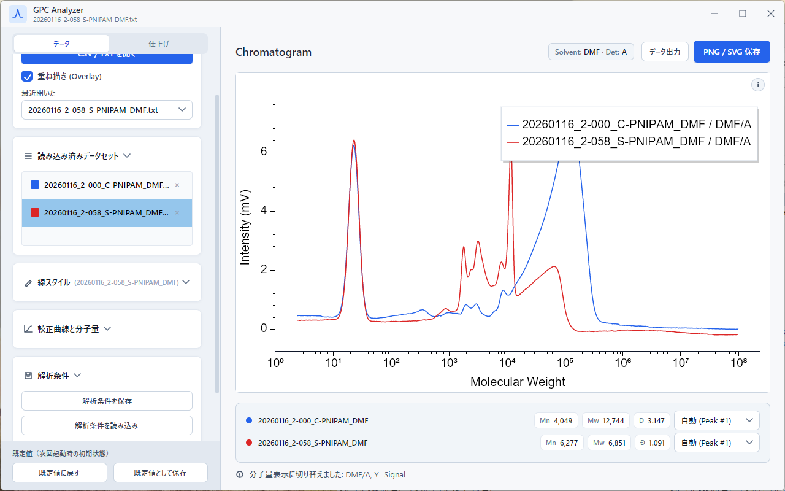
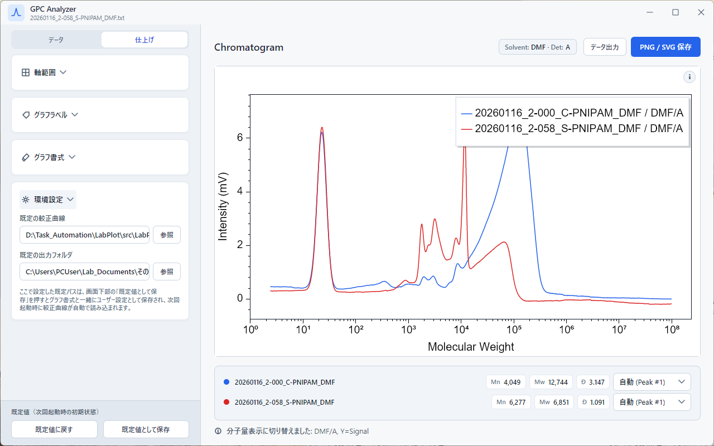

# GPC モジュールの使い方

GPC（ゲル浸透クロマトグラフィー）の測定データを読み込んで、クロマトグラムや分子量分布を表示し、PNG / SVG / Excel / CSV として書き出すためのモジュールです。Shimadzu LabSolutions の TXT エクスポート、または `Time, Signal` 形式の CSV / TSV に対応しています。

> 対象: LabPlot v1.4.1（Avalonia 主流版）

---

## このモジュールでできること

- LabSolutions TXT または `Time, Signal` 形式の CSV / TSV を読み込み、クロマトグラム表示
- 較正曲線 JSON を読み込んで保持時間 → 分子量変換、Mn / Mw / Đ の表示
- 複数データの重ね描き、線色・線幅・凡例名の個別設定
- 軸範囲・タイトル・フォント・グリッド・プロット枠・アスペクト比の調整
- 300 dpi PNG または SVG でグラフ書き出し、xlsx / csv で解析結果書き出し
- 解析条件（読み込み済みデータ・較正曲線・書式・軸範囲など）を `.gpcjson` として保存・復元

---

## 対応装置と事前準備

主な対応装置は **Shimadzu LabSolutions** です。装置側で TXT 形式にエクスポートしたファイルをそのまま開けます。任意のソフトで `Time, Signal` の 2 列形式（CSV / TSV / TXT）に整形したデータも読めます。

装置側でのエクスポート手順は [Shimadzu LabSolutions のデータ準備](./data-preparation/shimadzu-labsolutions.md) を参照してください。

---

## サイドバー構成（データ / 仕上げの 2 タブ）

サイドバーは上部のセグメントで**データ**タブと**仕上げ**タブに切り替えます。どちらのタブでも一番下の「既定値（次回起動時の初期状態）」フッターは常に表示されます。

| タブ | セクション |
| --- | --- |
| データ | データファイル / 読み込み済みデータセット / 線スタイル / 較正曲線と分子量 / 解析条件 |
| 仕上げ | 軸範囲 / グラフラベル / グラフ書式 / 環境設定 |

以下の手順では、各セクションがどちらのタブにあるかを都度示します。

---

## 1. データを開く

サイドバー上部「データファイル」セクションの **「CSV / TXT を開く」** をクリックして、GPC データファイル（`.csv` / `.tsv` / `.txt`）を選択します。

- **重ね描きしたいときは**、先に **「重ね描き (Overlay)」** にチェックを入れてから「CSV / TXT を開く」を押すと複数選択ができます。
- 読み込みに成功すると、ステータスバーに点数が表示され、グラフエリアにクロマトグラムが描かれます。
- 読み込み済みのデータは「読み込み済みデータセット」セクションに一覧表示されます。各行の右端の **×** で削除できます。

ファイルエクスプローラーから直接データセット一覧へドラッグ＆ドロップしても開けます（複数ファイル同時可）。リスト内のドラッグでデータセットを並べ替えると、ドラッグ中にゴースト表示が追従するので、目的の位置を狙いやすくなっています。



---

## 2. 較正曲線をロードして分子量表示にする

サイドバー**データ**タブの「較正曲線と分子量」セクションを開いて操作します。

1. **「較正曲線 JSON を開く」** で標準曲線の JSON ファイルを選択します（複数の溶媒・検出器を含む 1 ファイル形式に対応）。
2. **溶媒** と **検出器** を選びます。ファイル名に溶媒名が含まれていれば自動で推定します。
3. **「分子量表示」** にチェックを入れると、X 軸が `log10(M)`（表示は分子量）に切り替わります。
4. **Y 軸モード** で `Signal` か `dw/dlogM` を選びます。`dw/dlogM` は通常の GPC 分布と同じ向きになるよう保持時間を降順にして差分計算しています。

LabSolutions の TXT 中に `Average Molecular Weight Table` が含まれている場合は、`Total` 行を除く全ピーク候補が右下のドロップダウン「代表ピーク」から選べます。較正曲線を使った場合は変換結果から Mn / Mw / Đ が計算されます。

クロマトグラム上部のヘッダには、選択中の較正曲線に対応する溶媒と検出器のバッジが表示されるので、複数のデータを並行して扱うときの取り違えを防げます。



---

## 3. グラフ調整

サイドバー**データ**タブの「線スタイル」、**仕上げ**タブの「軸範囲」「グラフラベル」「グラフ書式」の各セクションから、書式を調整します。

- **線スタイル**（データタブ）: 選択中のデータセットの色・凡例名・線幅・マーカーサイズを設定します。色は名前付きプリセット（Indigo / Crimson など）と、Custom 選択時の hex 入力 / HSV パレット（彩度×明度の四角と色相スライダー）から選べます。重ね描きの場合は「読み込み済みデータセット」で対象を切り替えてから操作します。
- **軸範囲**: マウスでドラッグ・ホイール操作後、TextBox に表示された値を微調整するのが楽です。空欄に戻して **「自動範囲に戻す」** を押すと自動レンジに戻ります。
- **グラフラベル**: タイトル、X 軸、Y 軸ラベルを直接入力します。タイトル・軸ラベルは太字切替、タイトルは表示／非表示の切替もできます。
- **グラフ書式**: フォント、フォントサイズ、グリッド表示、プロット枠（色・幅）、アスペクト比（16:9 / 4:3 / 3:2 / 1:1 / 自動）を指定できます。

凡例の位置はドラッグでも変更できます。マウスを離した位置に最も近い 9 つの隅・辺・中央のいずれかに自動でアンカーされるので、データ領域からはみ出ることなく好きな位置に置けます。

書式設定は **「既定値として保存」** ボタンで `%AppData%\GPC_Visualization\formatting_config.json` に保存され、次回起動時に復元されます。**「既定値に戻す」** で保存済み設定にリセットできます。



---

## 4. 出力

メインエリア右上の 2 つのボタンから書き出します。

- **「PNG / SVG 保存」**: クロマトグラム画像を出力します。PNG は 3600 × 2160 / 300 dpi、SVG はベクターで保存されます。アスペクト比設定が出力サイズに反映されます。
- **「データ出力」**: 解析結果を Excel ブック（`.xlsx`）または CSV で書き出します。クロマトグラムの生データに加え、ピーク情報・分子量分布が含まれます。

複数データを重ね描きした状態で「データ出力」を押すと、各データセットごとの統計値（Mn / Mw / Đ）が一覧表示される形でブックに出力されます。投稿用の Figure と数値表をセットで揃えるのに便利です。



---

## 5. 解析条件を保存・読み込む

サイドバー**データ**タブ下部「解析条件」セクションから操作します。

- **「条件を保存」**: 読み込んでいるデータファイルパス、較正曲線、選択中の溶媒・検出器、軸範囲、書式、線スタイルなどをまとめて `.gpcjson` に書き出します。
- **「条件を読込」**: 保存した `.gpcjson` を読み込んで状態を復元します。データファイルや較正曲線の実体は元の場所から再読込されるため、ファイルが移動・削除されているとその項目だけ警告つきでスキップされます。

`.gpcjson` には絶対パスが含まれるので、別 PC に渡す場合は同じディレクトリ構造でデータファイルも揃えてください。詳細は [FAQ のセッションファイル可搬性](./faq.md#セッションファイル-gpcjson--specjson--dlsjson-を別-pc-や別ユーザーに渡しても大丈夫ですか) を参照してください。



---

## 6. 環境設定（任意）

サイドバー**仕上げ**タブ下部の「環境設定」セクションから、よく使う既定値を保存できます。

- **既定の較正曲線**: 設定しておくと、次回起動時に自動でこの較正曲線 JSON を読み込みます。
- **既定の出力フォルダ**: グラフ・データ・解析条件の保存ダイアログでこのフォルダが最初に開かれます。

入力後はサイドバー下部の **「既定値として保存」** を押すと反映されます。



---

## 詳細仕様メモ

- 分子量変換は次の 3 次多項式を使っています。
  ```text
  log10(M) = a*t^3 + b*t^2 + c*t + d
  M       = 10^log10(M)
  ```
- 分子量表示では `1` から `1e8` の範囲外を除外し、X 軸は `log10(M)` で描き、ラベルは分子量表記（10 のべき乗）に整形して表示します。
- `dw/dlogM` の Y 軸は、保持時間を降順に並べ替えてから差分を取り、通常の GPC 較正曲線で正の分布になるようにしています。
- 分子量表示中は、X Min / X Max は `log10(M)` ではなく分子量そのものを入力します。
- LabSolutions の `Average Molecular Weight Table` の `Total` 行は無視し、`%` 順で並べたピーク候補のみが代表ピークドロップダウンに表示されます。

---

## 困ったら

- データが読み込めない、グラフが描かれない場合: [トラブルシューティング](./troubleshooting.md)
- LabSolutions 側でのエクスポート手順を確認したい場合: [Shimadzu LabSolutions のデータ準備](./data-preparation/shimadzu-labsolutions.md)
- よくある質問: [FAQ](./faq.md)
