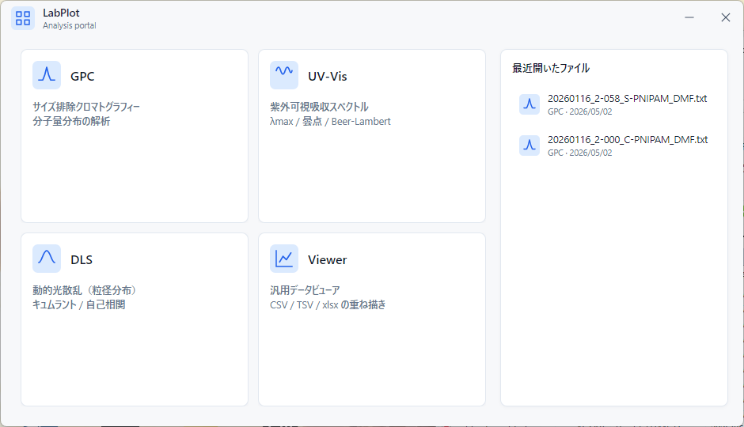

# インストール

LabPlot は研究室向けのポータル（カード型ランチャー）と、3 つの解析モジュール（GPC / Spectrum / DLS）、および汎用データビューア（Data Viewer）を 1 本にまとめた self-contained 実行ファイルとして配布されます。.NET ランタイムを別途インストールする必要はなく、配布物を解凍してダブルクリックすれば起動します。

> 対象: LabPlot v1.4.1（Avalonia 主流版、`LabPlot.Avalonia(.exe)`）
> 旧 WPF 版（`LabPlot.exe`、Windows 専用 v1.1.0 系）は本ページ末尾の補足を参照してください。

---

## システム要件

| OS | 必要環境 |
| --- | --- |
| Windows | Windows 10 / 11（x64） |
| macOS | macOS 12 以降（Apple Silicon、`osx-arm64`） |
| Linux | x64 ディストリビューション（Ubuntu 22.04 LTS で動作確認済み）。日本語表示には `fonts-noto-cjk` を推奨 |

.NET ランタイムは配布物に同梱されています。別途のインストールは不要です。

配布物（zip）は 44〜47 MB 程度（win-x64 で約 46 MB）、展開後は約 111 MB です。動作時のメモリ使用量は数百 MB 程度を見込んでおけば問題ありません。

---

## ダウンロード

リポジトリの GitHub Releases ページから、お使いの OS に合った zip を取得します。

- Releases: <https://github.com/unknowns53/LabPlot/releases>
- 配布物は `LabPlot-（バージョン番号）-win-x64.zip` の形式で添付されています。例えば v1.4.1 なら `LabPlot-v1.4.1-win-x64.zip` です。
- Windows（win-x64）/ macOS（osx-arm64）/ Linux（linux-x64）の 3 種類の zip が毎回添付されます。研究室の管理者から zip が手渡しで配布される運用も想定しています。
- macOS 向けには、最新版を固定 URL で取得するためのバージョン番号なしの別名アセット `LabPlot-macos-arm64.zip`（中身は osx-arm64 zip と同一）も添付されます。後述のターミナルからのインストールで使います。
- **macOS ではブラウザから zip をダウンロードしないでください。** 未署名アプリのため、ブラウザ経由で取得すると起動時に「壊れているため開けません」と表示されます。詳細と対処は「[インストール（macOS）](#インストールmacos)」を参照してください。

zip の中には、ポータル本体（Windows / Linux は `LabPlot.Avalonia(.exe)`、macOS は `LabPlot.app` バンドル）、解析モジュール 3 つと Data Viewer の DLL、サンプルデータ用フォルダ `samples/`、必要なランタイムファイルが入っています。

---

## インストール（Windows）

1. 取得した zip（例: `LabPlot-v1.4.1-win-x64.zip`）を任意のフォルダに解凍します。デスクトップでもドキュメントフォルダでも構いません。
2. 解凍してできたフォルダの中に `LabPlot.Avalonia.exe` があるので、ダブルクリックで起動します。
3. 初回起動時に SmartScreen の警告（「WindowsによってPCが保護されました」）が出ることがあります。「詳細情報」をクリックしたあと「実行」を選んでください。これは未署名の配布物に対して Windows が出す標準的な警告です。

ショートカットを作りたい場合は、`LabPlot.Avalonia.exe` を右クリック → 「ショートカットの作成」でデスクトップに置くと便利です。

---

## インストール（macOS）

macOS 版は Apple の開発者証明書（Developer ID）で署名していません。このため、ブラウザでダウンロードした zip から `LabPlot.app` を開こうとすると、Gatekeeper が「"LabPlot.app" は壊れているため開けません。ゴミ箱に入れる必要があります。」と表示します。ファイルが実際に壊れているわけではなく、ブラウザ経由のダウンロードで付く隔離属性（quarantine）と未署名の組み合わせに対する macOS 標準の警告です。最近の macOS では右クリック → 「開く」でこの警告を回避することはできません。

**推奨: ターミナルからインストールする**

ターミナル（アプリケーション → ユーティリティ → ターミナル）で次の 1 行を実行します。curl でのダウンロードには隔離属性が付かないため、警告なしでそのまま起動できます。

```bash
curl -L https://github.com/unknowns53/LabPlot/releases/latest/download/LabPlot-macos-arm64.zip -o /tmp/LabPlot.zip && ditto -x -k /tmp/LabPlot.zip /Applications/
```

`/Applications` に `LabPlot.app` が展開されるので、Launchpad または Finder からダブルクリックで起動します。更新のときも同じコマンドを再実行すれば上書きされます。

**ブラウザで zip をダウンロードしてしまった場合**

解凍した `LabPlot.app` に対して、ターミナルから隔離属性を外してから起動します。

```bash
xattr -dr com.apple.quarantine /Applications/LabPlot.app
```

パス（`/Applications/LabPlot.app` の部分）は実際に置いた場所に合わせて読み替えてください。

---

## インストール（Linux）

1. 取得した zip を任意のディレクトリ（例: `~/Apps/LabPlot`）に解凍します。
2. 実行権限を付与します。
   ```bash
   chmod +x ~/Apps/LabPlot/LabPlot.Avalonia
   ```
3. ダブルクリックで起動するか、ターミナルから直接実行します。
   ```bash
   ~/Apps/LabPlot/LabPlot.Avalonia
   ```
4. 日本語表示が豆腐（□□□）になる場合は CJK フォントをインストールしてください。
   ```bash
   sudo apt install fonts-noto-cjk
   ```

WSL2 + WSLg（Windows 11 標準）の環境でも GUI が立ち上がります。Wayland と X11 のどちらでも動作します。

---

## 起動と動作確認

ダブルクリックで起動すると、940 × 540 のカード型ランチャーが現れます。



カード上の「GPC」「UV-Vis」「DLS」「Viewer」をクリックすると、該当する解析ウィンドウが立ち上がります。各モジュールの操作手順は以下を参照してください。

- [GPC モジュールの使い方](./gpc.md)
- [Spectrum モジュールの使い方](./spectrum.md)
- [DLS モジュールの使い方](./dls.md)
- [Data Viewer モジュールの使い方](./viewer.md)

ポータル自体の細かい挙動（ウィンドウのドラッグ移動、重複起動の抑止など）は [ポータルの使い方](./portal.md) を参照してください。

---

## ログと設定の保存場所

LabPlot は使用中の例外ログ（`shell-error.log`）と、ユーザーごとの書式設定（`formatting_config.json`）を OS のユーザー領域に保存します。配布物を置いたフォルダには書き込みません。

**例外ログ**

| OS | ログパス |
| --- | --- |
| Windows | `%LocalAppData%\LabPlot\Logs\shell-error.log` |
| macOS | `~/Library/Application Support/LabPlot/Logs/shell-error.log` |
| Linux | `~/.local/share/LabPlot/Logs/shell-error.log` |

予期せず終了した場合や挙動がおかしい場合は、このファイルを確認すると原因の手がかりが得られます。詳しくは [トラブルシューティング](./troubleshooting.md) を参照してください。

**書式設定（モジュール別、Windows 上のパス）**

| モジュール | 保存先 |
| --- | --- |
| GPC | `%AppData%\GPC_Visualization\formatting_config.json` |
| Spectrum | `%AppData%\Spectrum_Visualization\formatting_config.json` |
| DLS | `%AppData%\LabPlot.DLS\formatting_config.json` |

`%AppData%` は Windows では `C:\Users\<ユーザー名>\AppData\Roaming` に解決されます。各モジュールの「既定値として保存」ボタンを押すと、現在の書式設定がここに書き出されます。次回起動時にも自動的に読み込まれます。macOS / Linux では、各 OS のユーザー設定ディレクトリ配下に同じ階層で保存されます。

---

## アンインストール

配布物を置いたフォルダごと削除すれば本体のアンインストールは完了します。加えて、上記のログ・書式設定ファイルを残したくない場合は、それぞれのパスにあるフォルダ（例: `%LocalAppData%\LabPlot`、`%AppData%\GPC_Visualization` など）も手動で削除してください。

レジストリへの書き込みやサービス登録は行っていないので、これ以外に残るファイルはありません。

---

## v1.0.x（旧 WPF 版）について

Windows 専用の旧 WPF 版（`LabPlot.exe`）は v1.1.0 系として保守されています。基本機能と操作感は Avalonia 主流版と共通ですが、新機能・バグ修正は Avalonia 主流版にのみ追加されます。

- 旧 WPF 版の入手先: 同じ Releases ページから v1.1.0 の zip を取得してください。
- 旧 WPF 版の操作手順は、各モジュールの README（`src/LabPlot.GPC/README.md` ほか）を参照してください。本ガイド（`docs/user-guide/`）は Avalonia 主流版を主軸に書いているので、UI の細部が一部異なる可能性があります。

新規利用者には Avalonia 主流版（現行 v1.4.1）を推奨します。

---

## 次のステップ

インストールが終わったら、[クイックスタート](./quick-start.md) で同梱サンプルを開いて PNG を 1 枚出すまでを試してみてください。
