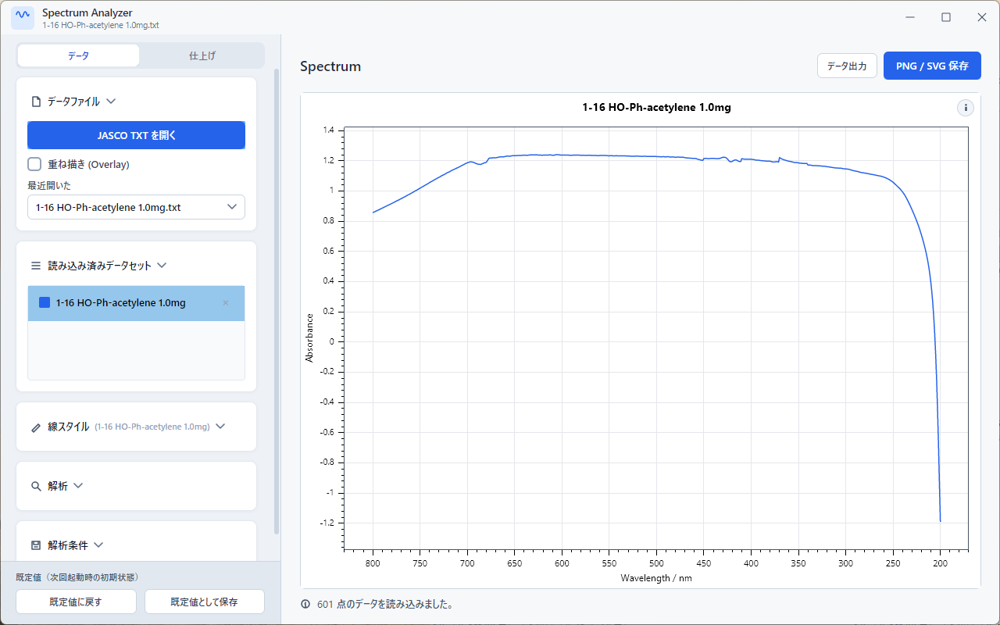
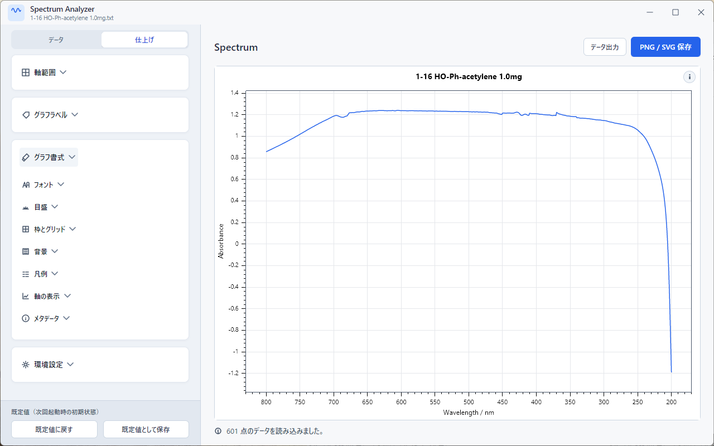
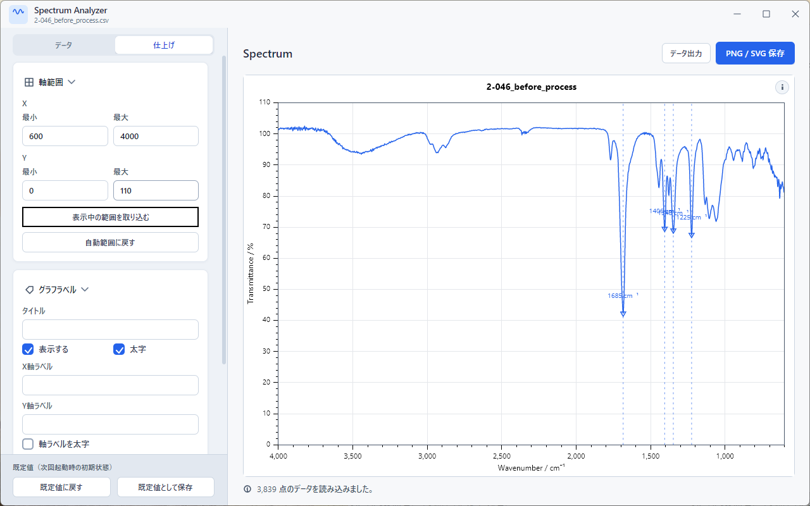
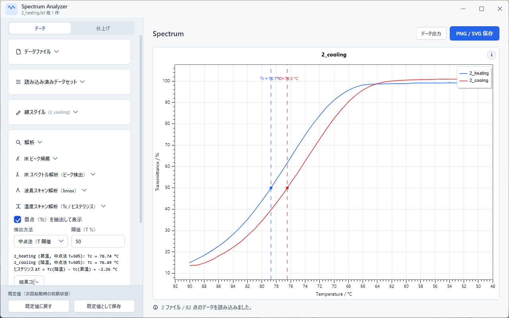
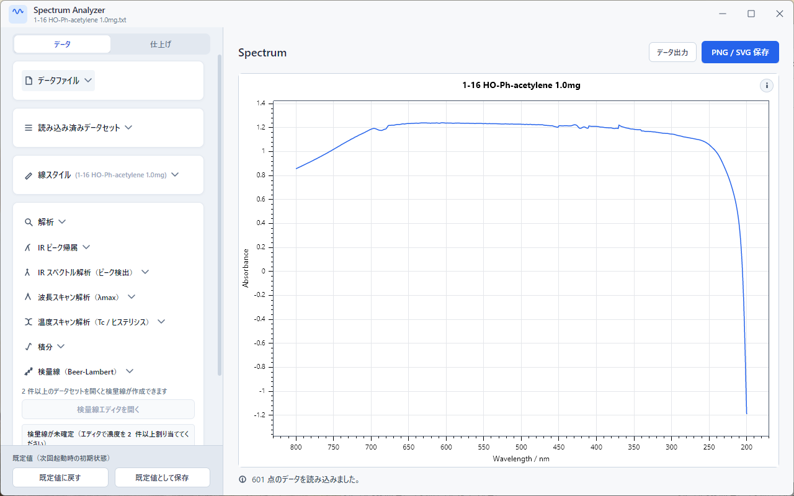
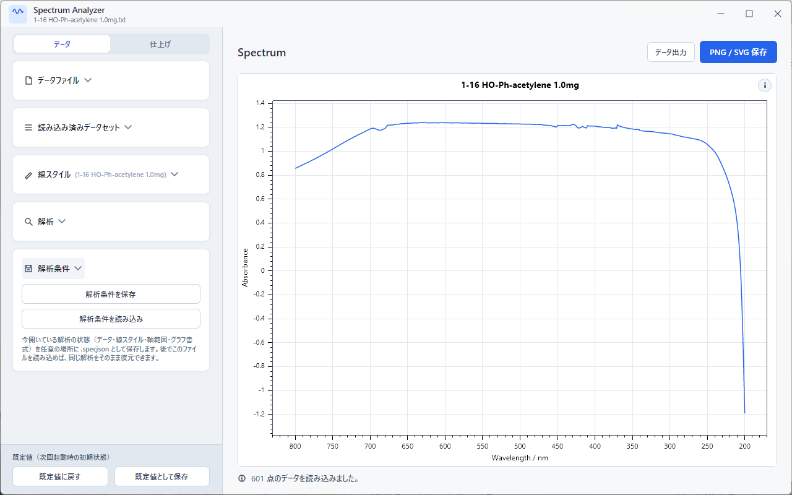
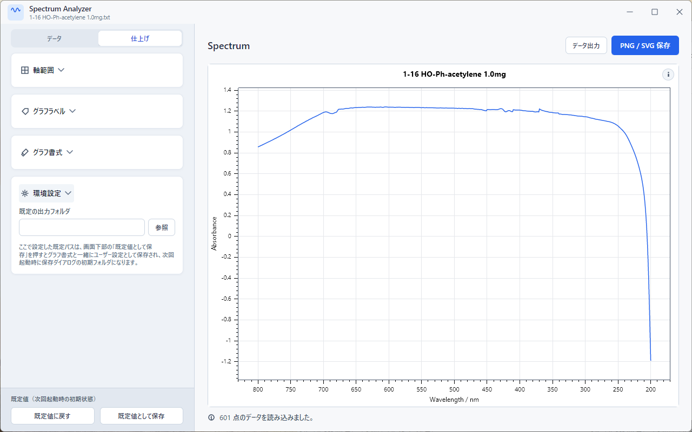

# Spectrum モジュールの使い方

UV-Vis 波長スキャン・温度スキャン・FTIR スペクトルの可視化と解析を行うモジュールです。JASCO Spectra Manager の TXT / CSV エクスポートを読み込み、ScottPlot による即時プレビュー、ピーク検出、領域積分、Beer-Lambert 検量線、Tc（曇点温度）推定までを 1 つのウィンドウから扱えます。

> 対象: LabPlot v1.4.1（Avalonia 主流版）

---

## このモジュールでできること

- JASCO V-750 系の UV-Vis TXT、FTIR CSV を自動判定で読み込み（区切り文字・Shift-JIS フッタの `[測定情報]` / `[付属品情報]` も解釈）
- 重ね描き、線色（プリセット + Custom HSV / hex）・線幅・凡例名の個別設定
- 波長スキャン: λmax 自動検出（プロミネンス / 高さ閾値、手動追加も可）、領域積分（None / Linear / 凸包 / rubber-band / 多項式ベースライン）、Beer-Lambert 検量線（吸光度・面積モード、外れ値除外）
- 温度スキャン: ヒステリシス（heating / cooling 対）対応、Tc を中点法 / 1 次微分極大 / 2 次微分極大 / Boltzmann sigmoid fit から選択
- IR: ピーク自動検出（プロミネンス + 窓幅 + 上位 N 個）、手入力ピーク帰属
- 軸範囲・タイトル・フォント・グリッド・プロット枠・アスペクト比の調整
- 300 dpi PNG または SVG で書き出し、xlsx / csv で解析結果を出力
- 解析条件を `.specjson` として保存・復元

---

## 対応装置と事前準備

主な対応装置は **JASCO V-750 系**（UV-Vis 分光光度計）と JASCO の FTIR 装置です。Spectra Manager から TXT / CSV 形式でエクスポートしたファイルをそのまま開けます。

ヘッダの `DATA TYPE` 行を見て、UV-Vis 波長スキャン / 温度スキャン / FTIR を自動判別するので、利用者がファイル種別を切り替える必要はありません。

装置側でのエクスポート手順は [JASCO V-750 のデータ準備](./data-preparation/jasco-v750.md) を参照してください。

---

## サイドバー構成（データ / 仕上げの 2 タブ）

サイドバーは上部のセグメントで**データ**タブと**仕上げ**タブに切り替えます。どちらのタブでも一番下の「既定値（次回起動時の初期状態）」フッターは常に表示されます。

| タブ | セクション |
| --- | --- |
| データ | データファイル / 読み込み済みデータセット / 線スタイル / 解析 / 解析条件 |
| 仕上げ | 軸範囲 / グラフラベル / グラフ書式 / 環境設定 |

以下の手順では、各セクションがどちらのタブにあるかを都度示します。

---

## 1. データを開く

サイドバー上部「データファイル」セクションの **「JASCO TXT を開く」** をクリックして、JASCO エクスポート（`.txt` / `.csv`）を選択します。

- **重ね描きしたいときは**、先に **「重ね描き (Overlay)」** にチェックを入れてから「JASCO TXT を開く」を押すと複数選択ができます。
- 読み込みに成功すると、ステータスバーに点数が表示され、グラフエリアにスペクトルが描かれます。読み込んだデータの種別（UV-Vis 波長 / 温度 / IR）はヘッダの `DATA TYPE` から自動判定されます。
- 読み込み済みのデータは「読み込み済みデータセット」セクションに一覧表示されます。リスト上のドラッグで並び替え（ドラッグ中はゴーストが追従）、各行右端の **×** で削除できます。
- ファイルエクスプローラーから直接データセット一覧へドラッグ＆ドロップしても開けます。



---

## 2. グラフ調整

サイドバー**データ**タブの「線スタイル」、**仕上げ**タブの「軸範囲」「グラフラベル」「グラフ書式」の各セクションから、書式を調整します。

- **線スタイル**（データタブ）: 選択中のデータセットの色・凡例名・線幅・マーカーサイズを設定します。色は名前付きプリセット（Indigo / Crimson など）と、Custom 選択時の hex 入力 / HSV パレット（彩度×明度の四角と色相スライダー）から選べます。
- **軸範囲**: マウスでドラッグ・ホイール操作後、TextBox に表示された値を微調整するのが楽です。空欄に戻して **「自動範囲に戻す」** を押すと自動レンジに戻ります。
- **グラフラベル**: タイトル、X 軸、Y 軸ラベルを直接入力します。タイトル・軸ラベルは太字切替、タイトルは表示／非表示の切替もできます。
- **グラフ書式**: フォント、フォントサイズ、グリッド表示、プロット枠（色・幅）、背景色、凡例位置、アスペクト比を指定できます。
- **軸の表示**: スペクトルの種別に応じた軸モードを切り替えます。波長 vs 波数、Absorbance vs %T などを切り替えると、Y 軸ラベルも自動で追従します。
- **メタデータ**: JASCO ヘッダの主要パラメータ（測定波長・スリット幅・スキャンスピード等）をプロット内に表示するかをチェックボックスで切り替えます。

凡例の位置はドラッグでも変更できます。マウスを離した位置に最も近い 9 つの隅・辺・中央のいずれかに自動でアンカーされます。

書式設定は **「既定値として保存」** ボタンで `%AppData%\Spectrum_Visualization\formatting_config.json` に保存され、次回起動時に復元されます。



---

## 3. 解析

サイドバー**データ**タブの「解析」グループには、データの種別に合わせて 6 つの解析サブセクションが並びます。表示中のデータセットに合わないものは無効化されます。

### 3.1 IR ピーク帰属

選んだピークに分子振動の帰属（C=O ストレッチなど）を手入力で添えられます。一括で有効化／無効化するボタンつきです。投稿論文用の Figure に帰属ラベルを乗せたい場合に便利です。

### 3.2 IR スペクトル解析（ピーク自動検出）

最小吸光度・最小プロミネンス・窓幅・上位 N 個の条件で自動検出します。`scipy.signal.find_peaks` と同じプロミネンス定義を使うため、傾いたベースライン上のリップルや真のピーク両脇の小山を弾けます。手動でピークを追加することもできます。



### 3.3 波長スキャン解析（λmax）

UV-Vis 用です。最小吸光度・窓幅・上位 N 個の条件で λmax 候補を抽出します。プロット上をクリックして手動で λmax を追加することもできます。

### 3.4 温度スキャン解析（Tc / ヒステリシス）

温度スキャンで Tc を推定します。

- **中点法**: 閾値（既定 50 %）で交差点を取ります。
- **1 次微分極大法**: 移動平均で平滑化したあと 1 次微分の極大点を取ります。
- **2 次微分極大法**: 同じく 2 次微分の極大点。
- **Boltzmann sigmoid fit**: 4 パラメータの Levenberg–Marquardt フィットで Tc・k・R² を返します。フィットカーブとパラメータの表示も切替可能です。

冷却・加熱を対にして読み込むとヒステリシスも観察できます。同梱サンプルの `2_heating.txt` / `2_cooling.txt` で試せます。



### 3.5 積分

任意の波長範囲を「積分領域」として追加し、ベースライン（None / Linear / 凸包 / rubber-band / 多項式）を選んで台形則で積分します。Y 軸が Absorbance でないデータセット（Reflectance、温度…）は自動的に空結果になります。結果は xlsx / csv に書き出せます。

### 3.6 検量線（Beer-Lambert）

「検量線エディタを開く」ボタンを押すと、検量線エディタが別ウィンドウで開きます。複数データセットの濃度（mol/L 換算）と吸光度／積分面積を入力して 1 次回帰します。外れ値除外、フィット結果（傾き・切片・R²）の出力に対応しています。



---

## 4. 出力

メインエリア右上の 2 つのボタンから書き出します。

- **「PNG / SVG 保存」**: スペクトル画像を出力します。PNG は 3600 × 2160 / 300 dpi、SVG はベクターで保存されます。アスペクト比設定が出力サイズに反映されます。
- **「データ出力」**: 解析結果を Excel ブック（`.xlsx`）または CSV で書き出します。生データに加え、検出済みピーク・積分結果・検量線情報が含まれます。

積分・検量線セクションには独立した出力ボタンも用意されているので、解析の中身だけを取り出すこともできます。

---

## 5. 解析条件を保存・読み込む

サイドバー**データ**タブ下部「解析条件」セクションから操作します。

- **「条件を保存」**: 読み込んでいるデータファイルパス、線スタイル、軸範囲、書式、ピーク・積分領域・検量線などの解析パラメータを `.specjson` に書き出します。
- **「条件を読込」**: 保存した `.specjson` を読み込んで状態を復元します。データファイルの実体は元の場所から再読込されるため、ファイルが移動・削除されているとその項目だけ警告つきでスキップされます。



---

## 6. 環境設定（任意）

サイドバー**仕上げ**タブ下部の「環境設定」セクションから、よく使う既定値を保存できます。

- **既定の出力フォルダ**: グラフ・データ・解析条件の保存ダイアログでこのフォルダが最初に開かれます。

入力後はサイドバー下部の **「既定値として保存」** を押すと反映されます。



---

## 詳細仕様メモ

- JASCO Spectra Manager の TXT は Shift-JIS、ヘッダ部とデータブロックを `XYDATA` 行で区切り、後続の `[測定情報]` / `[付属品情報]` セクションも解釈してメタデータとして保持します。区切り文字（タブ／カンマ）は行ごとに自動判定するので、UV-Vis V-series の TXT と FTIR CSV を同じリーダで読めます。
- 積分は常に Absorbance 空間で行います。データセットが %T の場合は内部で `A = 2 - log10(%T)` 変換した上で台形則を適用します。Reflectance や温度のように Absorbance に変換できない YUNITS は空結果を返します。
- λmax / IR ピーク自動検出は、まず窓幅 ±N 内の局所最大を取り、続いてプロミネンス（その点から両側に歩き、より高い点に出会うまでに遭遇する谷の最高値からの差）でフィルタリングします。`scipy.signal.find_peaks` と同じ定義です。
- 温度スキャンの Boltzmann sigmoid fit は次式を Levenberg–Marquardt 法で最小二乗推定します。R² が低いときは結果ラベルに警告が出ます。
  ```text
  T(temp) = T_low + (T_high − T_low) / (1 + exp((temp − Tc) / k))
  ```
- セッション JSON は UTF-8（BOM 付き）で書き出され、書式設定の `formatting_config.json` とは別のファイルです。

---

## 困ったら

- データが読み込めない、文字化けする、グラフが描かれない場合: [トラブルシューティング](./troubleshooting.md)
- JASCO 側でのエクスポート手順を確認したい場合: [JASCO V-750 のデータ準備](./data-preparation/jasco-v750.md)
- よくある質問: [FAQ](./faq.md)
